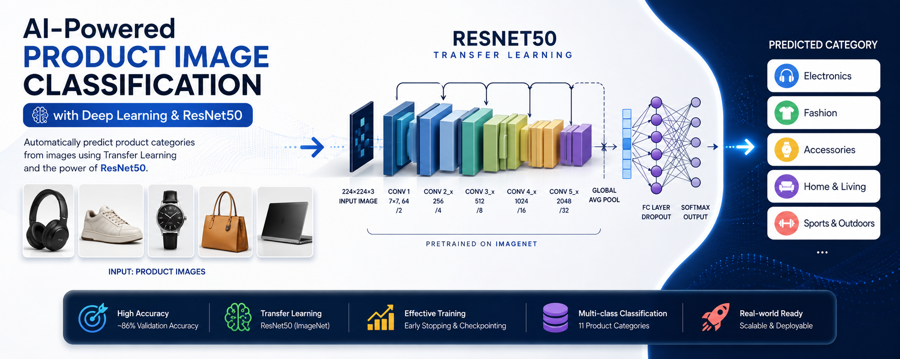
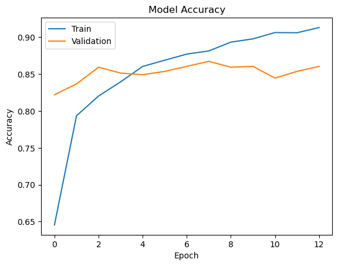

# 🛍️ Product Image Classification using Deep Learning & ResNet50

<p align="center">
  
</p>

<div align="center">


</div>

---

## 🌟 Project Highlights

✅ Deep Learning Based Product Classification

✅ Transfer Learning with ResNet50

✅ Multi-Class Image Classification

✅ TensorFlow / Keras Implementation

✅ Validation Accuracy ≈ **86%**

✅ End-to-End Computer Vision Pipeline

---

## 📖 Overview

Modern e-commerce platforms host millions of products distributed across thousands of categories.

Manual product categorization is expensive, slow, and error-prone. This project introduces an AI-powered image classification system capable of automatically predicting a product's category directly from its image.

The model leverages **Transfer Learning** using the powerful **ResNet50 architecture**, pretrained on ImageNet, to achieve high classification performance while reducing training time and computational requirements.

---

## 🎯 Problem Statement

Given an image of a product:

```text
Input → Product Image
```

Predict:

```text
Output → Product Category
```

This task is formulated as a **Multi-Class Image Classification** problem.

---

## 🏆 Results

| Metric | Score |
|----------|--------|
| Training Accuracy | 91% |
| Validation Accuracy | 86% |

### Training Performance

<p align="center">
  
</p>

The model demonstrates strong convergence and good generalization capability on unseen validation data.

---

## 🧠 Model Architecture

The classification model is built on top of **ResNet50**, a deep residual neural network originally trained on the ImageNet dataset.

### Architecture Pipeline

```text
Product Image
      │
      ▼
Image Preprocessing
      │
      ▼
ResNet50 Backbone
      │
      ▼
Global Average Pooling
      │
      ▼
Dense Layer
      │
      ▼
Dropout
      │
      ▼
Softmax Output
      │
      ▼
Predicted Category
```

### Why ResNet50?

- Residual Connections mitigate vanishing gradients.
- Strong feature extraction capabilities.
- Proven performance on image classification benchmarks.
- Faster convergence using pretrained ImageNet weights.
- Effective even with relatively limited datasets.

---

## 🔧 Data Preprocessing

The following preprocessing techniques were applied:

### Image Processing

- Image resizing to **224×224**
- RGB conversion
- ResNet50-specific preprocessing
- Batch generation

### Dataset Preparation

- Label encoding
- Validation split
- Data pipeline optimization
- Efficient loading using TensorFlow Dataset API

---

## 🚀 Training Strategy

Several techniques were employed to improve performance and stability:

- Transfer Learning
- Fine-Tuning
- Early Stopping
- Model Checkpointing
- Learning Rate Scheduling
- Validation Monitoring

---

## 📊 Workflow

```text
Raw Product Images
         │
         ▼
 Image Preprocessing
         │
         ▼
 Transfer Learning
      (ResNet50)
         │
         ▼
 Feature Extraction
         │
         ▼
 Classification Head
         │
         ▼
 Category Prediction
```

---

## 💼 Real-World Applications

This project can be integrated into:

### 🛒 E-Commerce Platforms

Automatic product categorization and catalog management.

### 🔍 Search Systems

Improved product discovery and retrieval.

### 🎯 Recommendation Engines

Better recommendation quality through accurate categorization.

### 📦 Inventory Management

Automated organization of product databases.

### 🤖 AI-Powered Marketplaces

Reducing manual labeling efforts and operational costs.

---

## 🛠 Technologies Used

| Category | Technologies |
|-----------|-------------|
| Language | Python |
| Deep Learning | TensorFlow, Keras |
| Computer Vision | ResNet50 |
| Data Processing | NumPy, Pandas |
| Visualization | Matplotlib |
| Evaluation | Scikit-Learn |
| Environment | Jupyter Notebook |

---

## 📂 Project Structure

```text
product-image-classification-resnet50/
│
├── data/
│   └── README.md
│
├── images/
│   ├── project_banner.png
│   └── training_accuracy.png
│
├── notebooks/
│   └── image_categorizer_solution.ipynb
│
├── README.md
├── requirements.txt
├── LICENSE
└── .gitignore
```

---

## ⚡ Installation

Clone the repository:

```bash
git clone https://github.com/moeinalva/product-image-classification-resnet50.git
```

Navigate to the project directory:

```bash
cd product-image-classification-resnet50
```

Install dependencies:

```bash
pip install -r requirements.txt
```

Launch Jupyter Notebook:

```bash
jupyter notebook
```

---

## 🔮 Future Improvements

- EfficientNet Implementation
- Vision Transformers (ViT)
- Advanced Data Augmentation
- Hyperparameter Optimization
- Ensemble Learning
- Model Quantization
- Deployment with FastAPI
- Docker Containerization

---

## 👨‍💻 Author

### Moein Alva

Machine Learning & Deep Learning Enthusiast

Focused on:

- Computer Vision
- Deep Learning
- Machine Learning
- AI Applications
- Algorithmic Trading Systems

GitHub:

```text
https://github.com/moeinalva
```

---

## 📄 License

This project is licensed under the MIT License.

---

<div align="center">

⭐ If you found this project useful, consider giving it a star.

</div>
